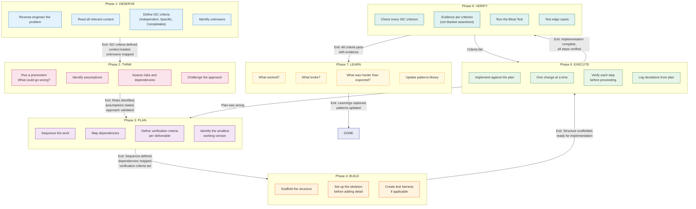

# Algorithm: 7-Phase Execution Cycle

A rigorous execution framework for any non-trivial task. Each phase has specific activities and exit criteria. Phases are sequential -- do not skip phases or start the next before the current one is complete.

## Phase Details

| Phase | Purpose | Key Question | Exit Criteria |
|-------|---------|-------------|---------------|
| **OBSERVE** | Understand the problem fully before acting | "Do I know what done looks like?" | ISC criteria defined, context loaded, unknowns listed |
| **THINK** | Stress-test the approach before committing | "What could go wrong?" | Risks identified, assumptions explicit, approach validated |
| **PLAN** | Sequence work for efficient execution | "What order minimizes rework?" | Steps sequenced, dependencies mapped, verification defined |
| **BUILD** | Create structure before filling in detail | "Is the skeleton sound?" | Scaffolding in place, ready for implementation |
| **EXECUTE** | Implement one step at a time | "Did this step work before I move on?" | All steps implemented and individually verified |
| **VERIFY** | Confirm the work meets the original criteria | "Can I prove each criterion is met?" | Every ISC criterion passes with specific evidence |
| **LEARN** | Extract lessons for future work | "What would I do differently?" | Learnings logged, patterns updated |

## Common Failure Modes

| Failure | Which Phase Was Skipped | Fix |
|---------|------------------------|-----|
| Built the wrong thing | OBSERVE | Define ISC before starting |
| Didn't anticipate obvious risk | THINK | Run the premortem |
| Constant rework | PLAN | Sequence dependencies properly |
| "It works on my machine" | VERIFY | Evidence per criterion, not assertions |
| Same mistake twice | LEARN | Capture the pattern |
