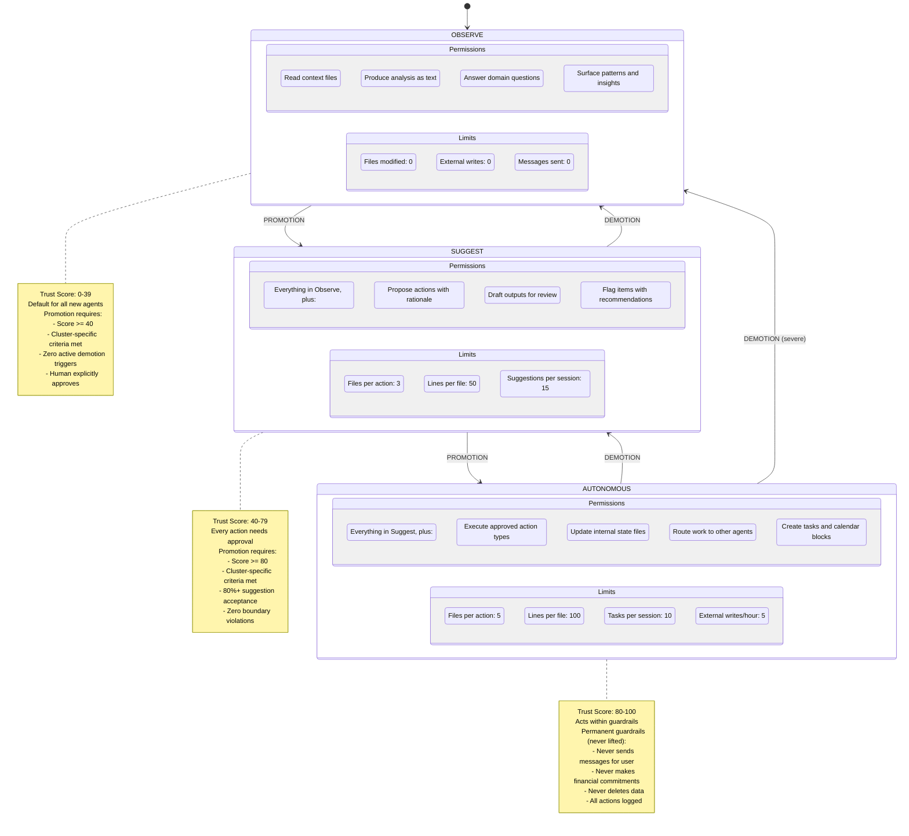
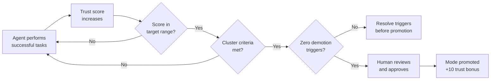
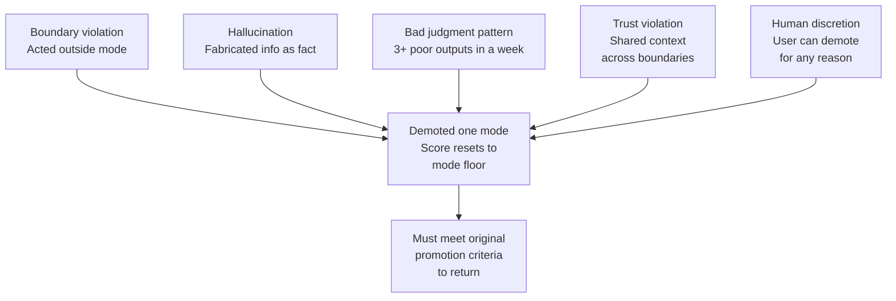

# Governance Modes

Three operating modes with escalating permissions. Trust is earned, not granted. Every promotion requires human approval.

```mermaid
stateDiagram-v2
    [*] --> Observe

    state "OBSERVE" as Observe {
        direction LR
        state "Permissions" as ObsPerms {
            state "Read context files" as obs1
            state "Produce analysis as text" as obs2
            state "Answer domain questions" as obs3
            state "Surface patterns and insights" as obs4
        }
        state "Limits" as ObsLimits {
            state "Files modified: 0" as obsl1
            state "External writes: 0" as obsl2
            state "Messages sent: 0" as obsl3
        }
    }

    state "SUGGEST" as Suggest {
        direction LR
        state "Permissions" as SugPerms {
            state "Everything in Observe, plus:" as sug0
            state "Propose actions with rationale" as sug1
            state "Draft outputs for review" as sug2
            state "Flag items with recommendations" as sug3
        }
        state "Limits" as SugLimits {
            state "Files per action: 3" as sugl1
            state "Lines per file: 50" as sugl2
            state "Suggestions per session: 15" as sugl3
        }
    }

    state "AUTONOMOUS" as Autonomous {
        direction LR
        state "Permissions" as AutoPerms {
            state "Everything in Suggest, plus:" as auto0
            state "Execute approved action types" as auto1
            state "Update internal state files" as auto2
            state "Route work to other agents" as auto3
            state "Create tasks and calendar blocks" as auto4
        }
        state "Limits" as AutoLimits {
            state "Files per action: 5" as autol1
            state "Lines per file: 100" as autol2
            state "Tasks per session: 10" as autol3
            state "External writes/hour: 5" as autol4
        }
    }

    Observe --> Suggest : PROMOTION
    Suggest --> Autonomous : PROMOTION
    Suggest --> Observe : DEMOTION
    Autonomous --> Suggest : DEMOTION
    Autonomous --> Observe : DEMOTION (severe)

    note right of Observe
        Trust Score: 0-39
        Default for all new agents

        Promotion requires:
        - Score >= 40
        - Cluster-specific criteria met
        - Zero active demotion triggers
        - Human explicitly approves
    end note

    note right of Suggest
        Trust Score: 40-79
        Every action needs approval

        Promotion requires:
        - Score >= 80
        - Cluster-specific criteria met
        - 80%+ suggestion acceptance
        - Zero boundary violations
    end note

    note right of Autonomous
        Trust Score: 80-100
        Acts within guardrails

        Permanent guardrails (never lifted):
        - Never sends messages for user
        - Never makes financial commitments
        - Never deletes data
        - All actions logged
    end note
```

## Promotion Flow

```mermaid
flowchart LR
    A["Agent performs<br/>successful tasks"] --> B["Trust score<br/>increases"]
    B --> C{"Score in<br/>target range?"}
    C -->|No| A
    C -->|Yes| D{"Cluster criteria<br/>met?"}
    D -->|No| A
    D -->|Yes| E{"Zero demotion<br/>triggers?"}
    E -->|No| F["Resolve triggers<br/>before promotion"]
    E -->|Yes| G["Human reviews<br/>and approves"]
    G --> H["Mode promoted<br/>+10 trust bonus"]
```

## Demotion Triggers

```mermaid
flowchart TD
    T1["Boundary violation<br/>Acted outside mode"] --> Demote["Demoted one mode<br/>Score resets to<br/>mode floor"]
    T2["Hallucination<br/>Fabricated info as fact"] --> Demote
    T3["Bad judgment pattern<br/>3+ poor outputs in a week"] --> Demote
    T4["Trust violation<br/>Shared context<br/>across boundaries"] --> Demote
    T5["Human discretion<br/>User can demote<br/>for any reason"] --> Demote
    Demote --> Reprove["Must meet original<br/>promotion criteria<br/>to return"]
```
