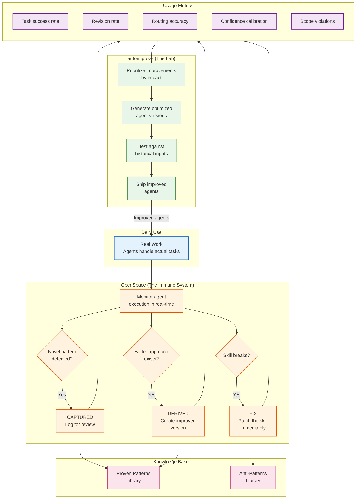

# Self-Improvement Loop

The feedback cycle that makes agents better over time. Two systems work together: OpenSpace monitors in real-time, autoimprove optimizes overnight.

## How the Two Systems Differ

```mermaid
graph LR
    subgraph openspace["OpenSpace"]
        direction TB
        os1["Watches in real-time"]
        os2["Reacts to immediate failures"]
        os3["Patches broken skills"]
        os4["Captures novel patterns"]
        os5["Defensive: prevents degradation"]
    end

    subgraph autoimprove["autoimprove"]
        direction TB
        ai1["Runs overnight / on-demand"]
        ai2["Analyzes aggregate metrics"]
        ai3["Generates optimized versions"]
        ai4["Tests against historical data"]
        ai5["Offensive: drives improvement"]
    end

    openspace ---|"Real-time signals<br/>feed overnight<br/>optimization"| autoimprove
    autoimprove ---|"Improved agents<br/>monitored by<br/>immune system"| openspace
```

