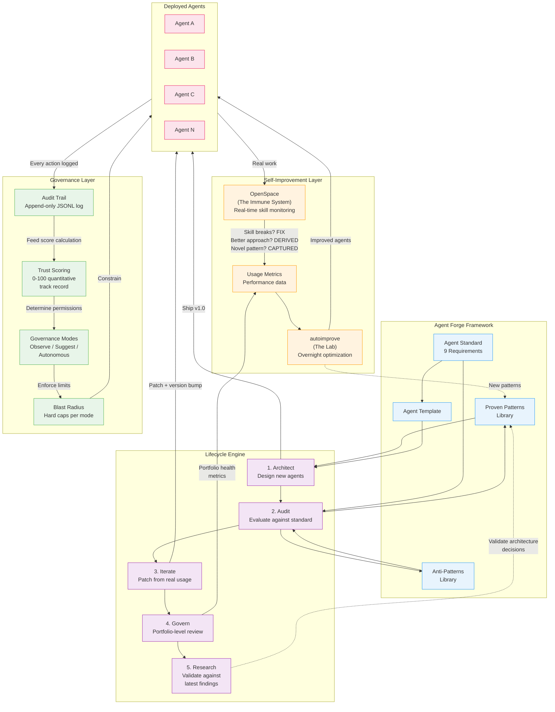

# System Overview

How all pieces of Agent Forge connect.

```mermaid
graph TB
    subgraph framework["Agent Forge Framework"]
        Standard["Agent Standard<br/>9 Requirements"]
        Template["Agent Template"]
        Patterns["Proven Patterns<br/>Library"]
        AntiPatterns["Anti-Patterns<br/>Library"]
    end

    subgraph lifecycle["Lifecycle Engine"]
        Architect["1. Architect<br/>Design new agents"]
        Audit["2. Audit<br/>Evaluate against standard"]
        Iterate["3. Iterate<br/>Patch from real usage"]
        Govern["4. Govern<br/>Portfolio-level review"]
        Research["5. Research<br/>Validate against<br/>latest findings"]
    end

    subgraph selfimprove["Self-Improvement Layer"]
        autoimprove["autoimprove<br/>(The Lab)<br/>Overnight optimization"]
        openspace["OpenSpace<br/>(The Immune System)<br/>Real-time skill monitoring"]
        metrics["Usage Metrics<br/>Performance data"]
    end

    subgraph governance["Governance Layer"]
        Trust["Trust Scoring<br/>0-100 quantitative<br/>track record"]
        Modes["Governance Modes<br/>Observe / Suggest /<br/>Autonomous"]
        Blast["Blast Radius<br/>Hard caps per mode"]
        AuditTrail["Audit Trail<br/>Append-only JSONL log"]
    end

    subgraph agents["Deployed Agents"]
        Agent1["Agent A"]
        Agent2["Agent B"]
        Agent3["Agent C"]
        AgentN["Agent N"]
    end

    %% Framework flows
    Standard --> Template
    Standard --> Audit
    Patterns --> Architect
    AntiPatterns --> Audit

    %% Lifecycle flows
    Template --> Architect
    Architect --> Audit
    Audit --> Iterate
    Audit --> Patterns
    Audit --> AntiPatterns
    Iterate --> Govern
    Govern --> Research
    Research -.->|"Validate architecture<br/>decisions"| Patterns

    %% Lifecycle to agents
    Architect -->|"Ship v1.0"| agents
    Iterate -->|"Patch + version bump"| agents

    %% Governance flows
    agents -->|"Every action logged"| AuditTrail
    AuditTrail -->|"Feed score calculation"| Trust
    Trust -->|"Determine permissions"| Modes
    Modes -->|"Enforce limits"| Blast
    Blast -->|"Constrain"| agents

    %% Self-improvement flows
    agents -->|"Real work"| openspace
    openspace -->|"Skill breaks? FIX<br/>Better approach? DERIVED<br/>Novel pattern? CAPTURED"| metrics
    metrics --> autoimprove
    autoimprove -->|"Improved agents"| agents
    autoimprove -.->|"New patterns"| Patterns

    %% Govern to self-improvement
    Govern -->|"Portfolio health<br/>metrics"| metrics

    classDef framework fill:#e8f4fd,stroke:#2196F3
    classDef lifecycle fill:#f3e5f5,stroke:#9C27B0
    classDef selfimprove fill:#fff3e0,stroke:#FF9800
    classDef governance fill:#e8f5e9,stroke:#4CAF50
    classDef agents fill:#fce4ec,stroke:#E91E63

    class Standard,Template,Patterns,AntiPatterns framework
    class Architect,Audit,Iterate,Govern,Research lifecycle
    class autoimprove,openspace,metrics selfimprove
    class Trust,Modes,Blast,AuditTrail governance
    class Agent1,Agent2,Agent3,AgentN agents
```
