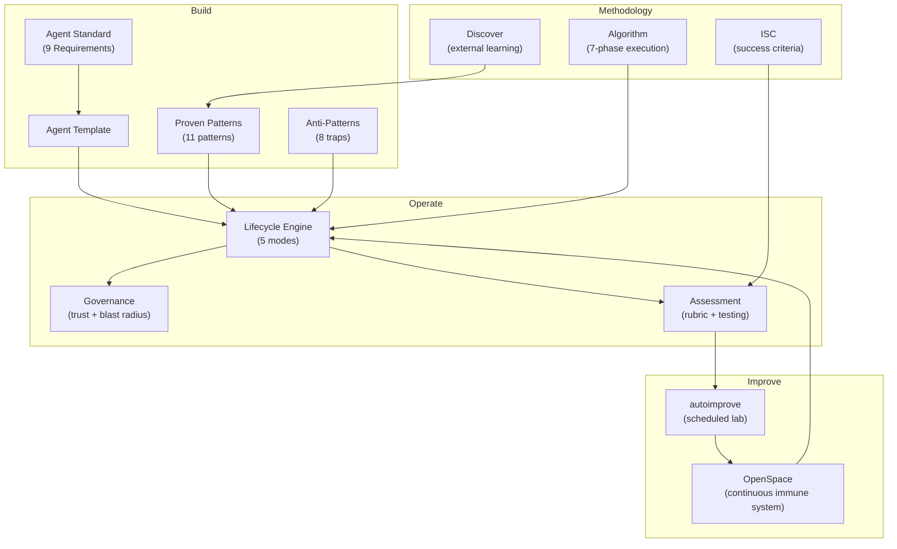

# Architecture

How Agent Forge's components fit together.

## System Overview



## Data Flow

### Building a New Agent

```
1. Read Standard ──> 2. Copy Template ──> 3. Fill 9 Sections
        │                                        │
        v                                        v
  Reference Patterns              Apply Bloat Test + Anti-Patterns
        │                                        │
        v                                        v
  4. Test (3 inputs) ──> 5. Set Governance ──> 6. Deploy
```

### Improving an Existing Agent

```
1. Score (autoimprove) ──> 2. Identify Weakest Dimensions
        │                            │
        v                            v
3. Propose Modification ──> 4. Re-score
        │                            │
   Improved?                    Regressed?
        │                            │
   git commit                   git reset
        │                            │
        v                            v
5. Promote to production     Try different modification
```

### Governance Lifecycle

```
OBSERVE (score 0-39)
  │
  │ Criteria met + human approval
  │
  v
SUGGEST (score 40-79)
  │
  │ Higher criteria + human approval
  │
  v
AUTONOMOUS (score 80-100)

  At any point:
  Boundary violation ──> Demotion (score resets to mode floor)
  Hallucination ──────> Demotion
  Bad judgment x3 ────> Demotion
```

## File Layout

```
Your project/
├── agents/                    # Your agent .md files
│   ├── researcher.md
│   ├── strategist.md
│   └── coordinator.md
├── governance/
│   ├── trust-scores.json      # Current trust scores
│   └── audit-log.jsonl        # Action log
├── test-cases/
│   └── {agent}/               # Test cases per agent
└── directives/
    └── {agent}.md             # Improvement goals per agent
```

Agent Forge (this repo) provides the framework. Your project uses it:
- Standards guide how you build agents
- Governance governs how agents operate
- autoimprove automates how agents improve
- The lifecycle engine structures the whole journey

## Key Design Decisions

1. **File-based, no databases.** JSON and JSONL files. Complexity comes later if needed.
2. **Human-in-the-loop for mode changes.** No auto-promotion. Trust is earned AND granted.
3. **Git as the improvement ratchet.** Commit improvements, revert regressions. History is the audit trail.
4. **Evaluator is immutable during runs.** The scoring engine never changes mid-loop. This prevents circular optimization.
5. **Agent files are the prompt.** No abstraction layer between the agent definition and what gets executed. The .md file IS the system prompt.
